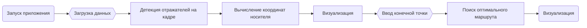

<h1> Разработка программного обеспечения для вычисления координат носителя в пространстве (Дипломная работа) </h1> 

<h2>  Описание </h2> 
<p>Программа разрабатывалась специально для центра коллективного пользования, чтобы корректировать движения системы для перевозки многотонного оборудования и направлять ее в теле тоннеля.</p>

<p> Эта система изначально ориентируется по специальной светоотражающей разметке, которая наносится на пол. Эту разметку легко повредить, из-за чего система может потерять ориентир и наехать на уже установленное оборудование. По этой причине было принято решение разработать нейросетевой подход к самопозиционированию системы. В теле тоннеля уже установлены специальные метки-отражатели, поэтому ориентирование будет происходить относительно их координат.</p>

<h2> Технологии </h2> 
<ul>
<li> Язык программирования: Python </li>
<li> Фреймворк: PyQt4 </li>
<li> Осн. библиотеки: OpenCV, Pandas, NumPy, Ultralytics(YOLOv11s), PIL </li>
<li> Датасет: авторский </li>
</ul>

<h2> Пайплайн </h2>



<h2> Датасет</h2>
<p> Датасет для обучения модели собирался и размечался в рамках поставленной задачи. В итоговый набор данных входит 1030 картинок, где 647 принадлежат классу одной модели отражателя, а 382 - классу второй модели. Разметка данных проходила с помощью открытого инструмента label-studio. </p> 

<p>Также для расширения датасета данные были аугментированы следующими способами: сдвиг изображения, затемнение/засветление кадра, отзеркаливание кадра по горизонтали. Собранного набора данных хватило для решения задачи детекции для поставленной цели.</p>


<h2> Обучение</h2>

<h2> Самопозиционирование носителя</h2>

<h2> Установка и использование</h2>

1. Скачать репозиторий:
   ```bash
   !git clone https://github.com/didilovu/Software-for-self-positioning.git  

2. Установить необходимые библиотеки
3. Запустить файл Calculate_my_coords.py