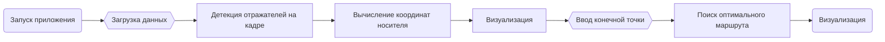
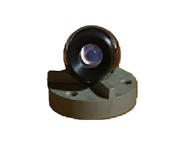
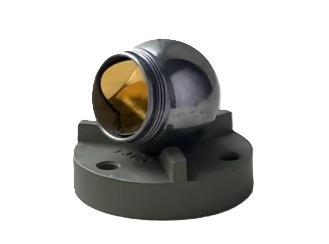

<h1> Разработка программного обеспечения для вычисления координат носителя в пространстве (Дипломная работа) </h1> 

<h2>  Описание </h2> 
<p>Программа разрабатывалась специально для центра коллективного пользования, чтобы корректировать движения системы для перевозки многотонного оборудования и направлять ее в теле тоннеля.</p>

<p> Эта система изначально ориентируется по специальной светоотражающей разметке, которая наносится на пол. Эту разметку легко повредить, из-за чего система может потерять ориентир и наехать на уже установленное оборудование. По этой причине было принято решение разработать нейросетевой подход к самопозиционированию системы. В теле тоннеля уже установлены специальные метки-отражатели, поэтому ориентирование будет происходить относительно их координат.</p>

<h2> Технологии </h2> 
<ul>
<li> Язык программирования: Python </li>
<li> Фреймворк: PyQt4 </li>
<li> Осн. библиотеки: OpenCV, Pandas, NumPy, Ultralytics(YOLOv11s), PIL </li>
<li> Датасет: авторский </li>
</ul>

<h2> Пайплайн </h2>



<h2> Датасет</h2>
<p> Датасет для обучения модели собирался и размечался в рамках поставленной задачи. В итоговый набор данных входит 1030 картинок, где 647 принадлежат классу одной модели отражателя, а 382 - классу второй модели. Разметка данных проходила с помощью открытого инструмента label-studio. </p> 
<p>Также для расширения датасета данные были аугментированы следующими способами: сдвиг изображения, затемнение/засветление кадра, отзеркаливание кадра по горизонтали. Собранного набора данных хватило для решения задачи детекции для поставленной цели.</p>

<p float="left">
   
   
</p>

<h2> Обучение</h2>

<p> Для обучения был использован YOLOv11s от Ultralytics.  
Обучение проводилось в течение 70 эпох с достижением следующих метрик: </p>


| Метрика       | Модель 1 | Модель 2 |
| :--- | :---: | :---: |
| **Precision** | 0.973   | 0.997   |
| **Recall**    | 0.961   | 0.980    |
| **mAP@50**    | 0.978   | 0.995   |
| **mAP@50-95** | 0.798   | 0.851   |
| **PR Curve**  | 0.983   | 0.993   |


<h2> Самопозиционирование носителя</h2>

`    A    `  
`   / \   `  
`  /   \  `  
` B1---B2 `

   <p> В данном случай B1 и B2 это специальные метки-отражатели, которые были найдены в кадре обученой моделью, а A - это камера. Координаты меток-отражателей мы знаем заранее из файла points.txt, поэтому узнать расстояние между ними можно по формуле: </p>

   $$C = \sqrt{(x_2 - x_1)^2 + (y_2 - y_1)^2}$$
   
   <p> Далее, по высоте бокса найденных отражателей алгоритм определяет расстояние между камерой и каждым из отражателей. Имея эти данные, алгоритм вычисляет координаты камеры по следующим формулам:</p>

   $$x_{cam} = \frac{x_1 + \left( x \cdot (x_2 - x_1) - y \cdot (y_2 - y_1) \right)}{C}$$

   $$y_{cam} = \frac{y_1 + \left( x \cdot (y_2 - y_1) + y \cdot (x_2 - x_1) \right)}{C}$$ 

<h2> Установка и использование</h2>

1. Скачать репозиторий:
   ```bash
   !git clone https://github.com/didilovu/Software-for-self-positioning.git  

2. Переход в директорию
    ```bash
   !cd Software-for-self-positioning

3. Установить необходимые библиотеки
    ```bash
   !pip install -r requirements.txt

4. Запустить скрипт
    ```bash
    !Calculate_my_coords.py

<p> В всплывающем окне необходимо выбрать источник, откуда будет считываться информация: изображение или видео. При выборе видео приложение запустит трансляцию с подключенной камеры, после чего алгоритмом будут обрабатываться кадр за кадром. Если в кадре будут присутствовать две модели отражателей, то в правой части окна приложения можно увидеть координаты начальной точки. Это и будут координаты камеры.</p>
<p> Далее, пользователь может ввести координаты конечной точки, после чего в правой части окна приложения алгоритм выведет покоординатно найденный оптимальный маршрут от начальной точки до конечной, избегая препятствия/стены/отражатели. </p>