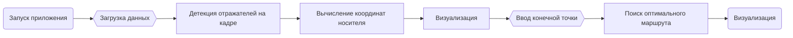

<h1> Разработка программного обеспечения для вычисления координат носителя в пространстве (Дипломная работа) </h1> 

<h2>  Описание </h2> 

Программа разрабатывалась специально для центра коллективного пользования, чтобы корректировать движения системы для перевозки многотонного оборудования и направлять ее в теле тоннеля.

 Эта система изначально ориентируется по специальной светоотражающей разметке, которая наносится на пол. Эту разметку легко повредить, из-за чего система может потерять ориентир и наехать на уже установленное оборудование. По этой причине было принято решение разработать нейросетевой подход к самопозиционированию системы. В теле тоннеля уже установлены специальные метки-отражатели, поэтому ориентирование будет происходить относительно их координат.

<h2> Технологии </h2> 
<ul>
<li> Язык программирования: Python </li>
<li> Фреймворк: PyQt4 </li>
<li> Осн. библиотеки: OpenCV, Pandas, NumPy, Ultralytics(YOLOv11s), PIL </li>
<li> Датасет: авторский </li>
</ul>

<h2> Пайплайн </h2>

